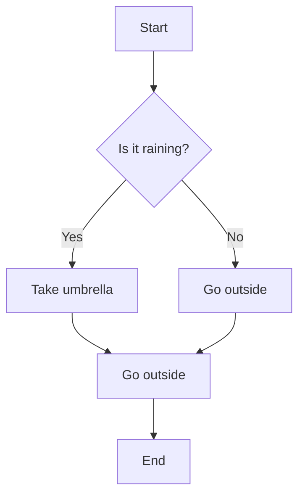

# Example Mermaid Diagram

This document contains an example of a Mermaid diagram embedded in markdown.

## Simple Flowchart

The diagram below shows a basic decision-making process:

## What is Mermaid?

Mermaid is a JavaScript-based diagramming and charting tool that renders Markdown-inspired text definitions to create and modify diagrams dynamically. It supports various diagram types including:

- Flowcharts
- Sequence diagrams  
- Gantt charts
- Class diagrams
- State diagrams
- And many more!

The syntax is simple and human-readable, making it easy to create and maintain diagrams alongside your documentation. 