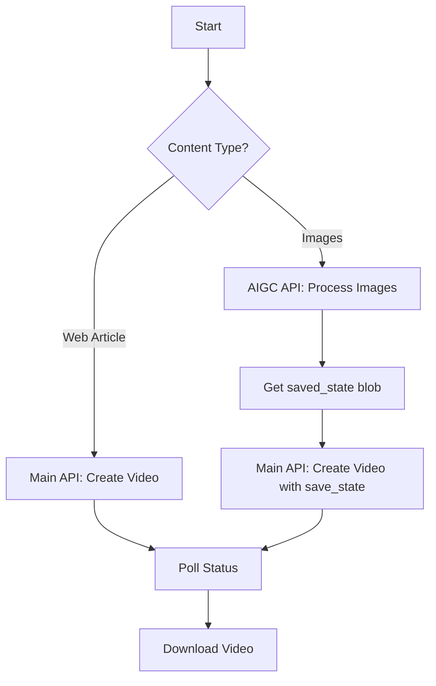

# Aeon API Documentation
{: .fs-9 }

Complete API reference for video creation and image processing
{: .fs-6 .fw-300 }

[Get started now](/getting-started/){: .btn .btn-primary .fs-5 .mb-4 .mb-md-0 .mr-2 } [View on GitHub](https://github.com/your-repo){: .btn .fs-5 .mb-4 .mb-md-0 }

---

## Status: Public Beta
{: .text-red-200}

> **Note:** Public beta – endpoints and payloads may change.

## Overview

Aeon provides two powerful APIs for content creation:

### 🎬 Main Video API
Convert written web content into engaging videos using configurable presets. Perfect for creating professional video content from articles, blog posts, and web pages.

**Base URL:** `https://app.project-aeon.com/api/1.1/wf/`

[Explore Video API →](/main-api/){: .btn .btn-outline }

### 🖼️ AIGC Preview API  
Process images through an AI pipeline with support for both URL-based and base64-encoded inputs. Generate AI descriptions and perform advanced image processing.

**Base URL:** `https://aigc-preview-889529529975.us-central1.run.app`

[Explore Image API →](/aigc-api/){: .btn .btn-outline }

---

## Quick Navigation

**Getting Started**
- [Authentication & Setup](/getting-started/#authentication--security)
- [Generate User Key](/getting-started/#generate-a-user-key)
- [Quick Start Guide](/getting-started/#quick-start)

**Video Creation API**
- [List Presets](/main-api/#list-presets)
- [Clone Presets](/main-api/#clone-a-preset)
- [Create Videos](/main-api/#create-a-video-from-a-preset)
- [Check Status](/main-api/#poll-video-status)

**Image Processing API**
- [Process Images](/aigc-api/#process-images-main-endpoint)
- [Base64 Support](/aigc-api/#input-methods)
- [Pipeline Configuration](/aigc-api/#pipeline-configuration-options)

**Reference**
- [Error Codes](/errors/)
- [Webhooks](/errors/#webhooks)
- [Changelog](/changelog/)

---

## Integration Workflow

---

## Features

- **🔐 Secure Authentication** - Bearer token + user key system
- **⚡ Webhook Support** - Get notified when processing completes
- **🎨 Customizable Presets** - Clone and modify video templates
- **🖼️ Multiple Input Types** - URLs, Base64 images, or web articles
- **🌍 Multi-language Support** - Generate content in various languages
- **📱 Professional Output** - High-quality MP4 videos ready for sharing

---

Need help? Check out our [Getting Started Guide](/getting-started/) or browse the complete [API Reference](/main-api/).
